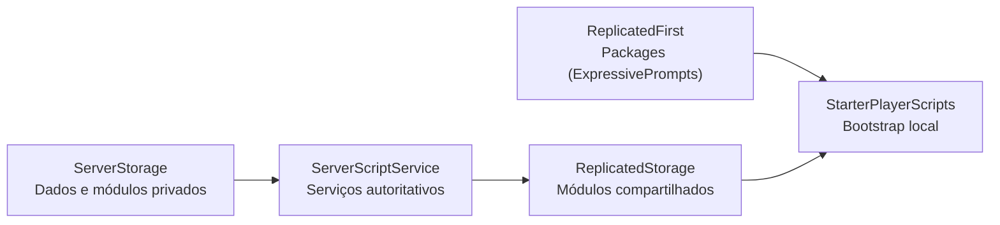

# Arquitetura

O template usa Rojo para definir a árvore do DataModel. O servidor mantém a autoridade sobre os dados persistentes e a configuração de personagens; o cliente inicializa interface, prompts e comportamentos locais.

## Mapeamento Rojo

| Diretório | Destino Roblox | Conteúdo |
| --- | --- | --- |
| `places/src - Lobby/ReplicatedFirst/` e `places/src - Partida/ReplicatedFirst/` | `ReplicatedFirst` | dependências necessárias antes do restante do cliente |
| `places/src - Lobby/ReplicatedStorage/` e `places/src - Partida/ReplicatedStorage/` | `ReplicatedStorage` | módulos compartilhados e remotes criados em execução |
| `places/src - Lobby/StarterPlayer/` e `places/src - Partida/StarterPlayer/` | `StarterPlayer` | scripts globais e scripts de personagem |
| `places/src - Lobby/ServerScriptService/` e `places/src - Partida/ServerScriptService/` | `ServerScriptService` | serviços e regras autoritativas |
| `places/src - Lobby/ServerStorage/` e `places/src - Partida/ServerStorage/` | `ServerStorage` | módulos e dependências privadas do servidor |

`lobby.project.json` e `partida.project.json` preservam instâncias desconhecidas nos serviços principais. Isso permite usar Rojo sobre cada place sem apagar assets que ainda existam apenas no place.

## Fluxos de execução

### Servidor

- `PlayerData.server.lua` abre e encerra sessões ProfileStore usando a chave compatível com o jogo original e conecta perfis ao `DataUtility`.
- `ServerStorage/Modules/ProfileData.lua` mantém o template nomeado, a versão do perfil e a migração da estrutura legada indexada.
- `InventoryActions.server.lua` valida equipar e comprar itens no servidor e publica as mudanças pelo `DataUtility`.
- `UpgradeActions.server.lua` valida compras de melhorias, desconta Cash e grava os níveis em `Inventory.Upgrades`.
- `RacingPassActions.server.lua` valida XP, reivindicações, recompensas, compras e recibos do Racing Pass no servidor.
- `ChallengesActions.server.lua` inicializa o `ChallengesService`, que mantém refresh, progresso e recompensas dos desafios.
- `CharacterSetup.server.lua` cria `Workspace.Characters` e aplica o grupo de colisão dos jogadores.

### Cliente

- `Audio/CharacterSounds.client.lua` reproduz sons locais associados ao personagem.
- `SprintController.client.lua` controla o sprint local, a animação de corrida e o estado do FOV por meio do `CameraFovController`.
- `Interface/Bootstrap.client.lua` inicializa as animações de interface e os prompts de proximidade.
- `Modules/Interface/ZoneInterface.lua` conecta as partes de `Workspace.Zones` ao ZonePlus e coordena a entrada e saída do jogador.
- `Modules/Interface/InterfaceController.lua` controla telas, topbars e o botão Back sem depender da implementação da detecção de zona.
- `Modules/Interface/PlayerCardController.lua` observa o `DataUtility` e atualiza o `PlayerCardBG`, estatísticas, progresso de XP e acesso à tela Settings.
- `Modules/Interface/InventorySlotController.lua` coordena os slots de Car, Avatar e Helmets, a ordenação por nível e a navegação para a loja.
- `Modules/Interface/UpgradeController.lua` conecta os cards de melhoria à compra validada pelo servidor e atualiza níveis, preços e saldo.
- `Modules/Interface/InventoryAssetRenderer.lua` resolve assets, normaliza veículos e calcula a câmera dinâmica dos `ViewportFrame`.
- `Modules/Interface/InventoryCardEffects.lua` aplica o hover e o reflexo dos cards, incluindo interação por toque.
- `Modules/Interface/CameraFovController.lua` mantém o FOV da interface e do sprint em um único controlador para evitar tweens concorrentes.
- `Modules/Interface/RacingPassController.lua` monta os trilhos de recompensas, calcula a apresentação de XP e abre prompts de produtos.
- `Modules/Interface/ChallengesController.lua` renderiza os cards, timers e o flip da tela de desafios a partir do `DataUtility`.

## Dados e rede

`PlayerData.server.lua` é o único ponto que inicia sessões de perfil. `DataUtility` cria os remotes de dados no servidor e oferece leitura e observação no cliente. Código cliente nunca grava o perfil diretamente.

O perfil usa grupos nomeados (`Currency`, `Inventory` e `Profile`) em vez de posições numéricas. A migração converte automaticamente o formato antigo (`[2]`, `[3]` e `[4]`) mantendo a chave `UserId .. "~PlayerProfile"` do jogo original.
