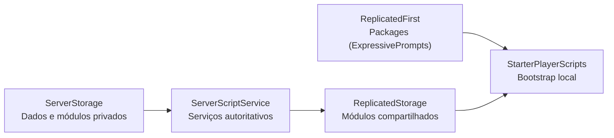

# Arquitetura

O template usa Rojo para definir a árvore do DataModel. O servidor mantém a autoridade sobre os dados persistentes e a configuração de personagens; o cliente inicializa interface, prompts e comportamentos locais.

## Mapeamento Rojo

| Diretório | Destino Roblox | Conteúdo |
| --- | --- | --- |
| `places/src - Lobby/ReplicatedFirst/` e `places/src - Partida/ReplicatedFirst/` | `ReplicatedFirst` | dependências necessárias antes do restante do cliente |
| `places/src - Lobby/ReplicatedStorage/` e `places/src - Partida/ReplicatedStorage/` | `ReplicatedStorage` | módulos compartilhados e remotes criados em execução |
| `places/src - Lobby/StarterPlayer/` e `places/src - Partida/StarterPlayer/` | `StarterPlayer` | scripts globais e scripts de personagem |
| `places/src - Lobby/ServerScriptService/` e `places/src - Partida/ServerScriptService/` | `ServerScriptService` | serviços e regras autoritativas |
| `places/src - Lobby/ServerStorage/` e `places/src - Partida/ServerStorage/` | `ServerStorage` | módulos e dependências privadas do servidor |

`lobby.project.json` e `partida.project.json` preservam instâncias desconhecidas nos serviços principais. Isso permite usar Rojo sobre cada place sem apagar assets que ainda existam apenas no place.

## Fluxos de execução

### Servidor

- `PlayerData.server.lua` abre e encerra sessões ProfileStore e conecta perfis ao `DataUtility`.
- `CharacterSetup.server.lua` cria `Workspace.Characters` e aplica o grupo de colisão dos jogadores.

### Cliente

- `Audio/CharacterSounds.client.lua` reproduz sons locais associados ao personagem.
- `Interface/Bootstrap.client.lua` inicializa as animações de interface e os prompts de proximidade.

## Dados e rede

`PlayerData.server.lua` é o único ponto que inicia sessões de perfil. `DataUtility` cria os remotes de dados no servidor e oferece leitura e observação no cliente. Código cliente nunca grava o perfil diretamente.
