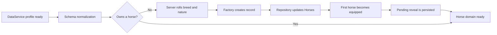

# Horse Core

This document describes the horse core implemented on August 6, 2026. It defines the system boundary, persistence contract, runtime flows, public API, validation rules, and the integrations that future horse-related systems must follow.

## Current scope

The horse core is the authoritative owner of:

- horse identity;
- horse ownership;
- the ordered horse collection;
- the equipped horse selection;
- starter horse creation;
- starter reveal persistence and acknowledgement;
- horse nickname filtering and persistence;
- horse record normalization and legacy migration;
- domain signals for grants, selection changes, and renames.

The following mechanics are intentionally outside this core:

- stable capacity and stall placement;
- horse models and world spawning;
- mounting and movement;
- need decay and care actions;
- bond progression;
- equipment transactions;
- roaming;
- races;
- collection rewards and quests.

Those systems must use the public horse API instead of reading or mutating `Horses.Owned` directly.

## Functional parity with the previous game

The implemented flow preserves the important behavior of the previous project:

1. Player data finishes loading.
2. Existing horse records are normalized.
3. The service checks whether the player owns a horse.
4. A player without horses receives exactly one starter horse.
5. The starter breed is selected from the original weighted pool.
6. The starter nature is selected from the original weighted nature pool.
7. The first horse becomes equipped automatically.
8. A pending starter reveal is persisted until the client acknowledges it.
9. Repeating the bootstrap does not grant another starter.

Stable slot validation from the previous `HorseService` is deferred until `StableService` exists. The horse core currently grants ownership without checking stable capacity.

## Runtime flow



All random decisions and persistent mutations happen on the server. The client can only request an equip change, a filtered rename, or reveal acknowledgement.

## Source layout

```text
src/
├── Shared/
│   ├── Information/Horses/
│   │   ├── Constants.luau
│   │   ├── HorseCatalog.luau
│   │   ├── NatureCatalog.luau
│   │   └── WeightedPool.luau
│   ├── Modules/Horses/
│   │   └── Summary.luau
│   ├── Services/HorseService/
│   │   └── init.luau
│   ├── Templates/
│   │   └── DataTemplate.luau
│   └── Types/
│       └── HorseTypes.luau
└── ServerScriptService/Services/HorseService/
    ├── init.luau
    ├── Core.luau
    ├── Factory.luau
    ├── Repository.luau
    ├── Schema.luau
    └── Tests.luau
```

### Module responsibilities

| Module | Responsibility |
| --- | --- |
| Server `init` | Lifecycle, player bootstrap, networking, and cleanup |
| `Core` | Public domain operations and domain signals |
| `Factory` | Construction of new minimal horse records |
| `Repository` | Exclusive DataService access for the `Horses` root |
| `Schema` | Normalization, invariant repair, and legacy migration |
| `Tests` | Focused factory, schema migration, and catalog tests |
| Client `HorseService` | Replicated reads and validated requests to the server |
| `HorseCatalog` | Immutable breed definitions and starter weights |
| `NatureCatalog` | Immutable nature definitions, effects, and weights |
| `Summary` | Safe combination of persistent data with catalog presentation data |

## Persistence contract

The profile stores the collection container below:

```luau
Horses = {
    SchemaVersion = 1,
    EquippedHorseId = "",
    OrderedIds = {},
    Owned = {},
}
```

Each entry in `Owned` stores only mutable player-owned state:

```luau
HorseRecord = {
    Version = 1,
    Id = "globally-unique-guid",
    CatalogId = "quarter_horse",
    Nickname = "Quarter",
    NatureId = "calm",
    Acquisition = {
        Source = "StarterGrant",
        ObtainedAt = 0,
    },
    Bond = {
        Level = 1,
        Experience = 0,
        TotalExperience = 0,
        Friendship = 15,
        LastProgressAt = 0,
    },
    Needs = {
        Happiness = 88,
        Hunger = 92,
        Thirst = 92,
        Cleanliness = 90,
        Health = 100,
        LastUpdatedAt = 0,
    },
    Equipment = {
        SaddleItemId = "",
    },
    Stats = {
        CareActions = 0,
        RacesEntered = 0,
        RacesWon = 0,
        BestRaceTimeMilliseconds = 0,
    },
}
```

Display names, rarity, tier, image, model name, movement stats, temperament, maximum needs, decay rates, and bond limits are not persisted. They are resolved from the immutable catalogs by `CatalogId` and `NatureId`.

This separation allows balance changes without rewriting every player profile.

The previously empty `DataTemplate` now also defines the baseline fields already consumed by the structural services: balances, playtime, last-online time, settings, gamepasses, developer products, total Robux spent, progression, and horses. This prevents existing services from indexing missing roots while ProfileStore reconciles new and existing profiles.

## Data invariants

`Schema.NormalizeState` guarantees these conditions:

- every owned horse has a non-empty string identifier;
- the dictionary key is the canonical horse identifier;
- every horse uses a known catalog definition;
- every horse uses a known nature;
- ordered identifiers are unique and reference owned horses;
- owned horses missing from the order are appended deterministically;
- `EquippedHorseId` is empty or references an owned horse;
- invalid numeric values are replaced or clamped;
- old `Nature`, `Bond.XP`, `Bond.TotalXP`, `Needs.Values`, and `BestRaceTimeMs` fields are migrated;
- obsolete immutable fields from legacy records are discarded.

ProfileStore cannot reconcile fields inside arbitrary dynamic `Owned` entries, so every horse record has its own `Version` and is normalized explicitly.

## Server API

### Queries

```luau
HorseService:GetHorse(Player, HorseId)
HorseService:GetEquippedHorse(Player)
HorseService:GetOwnedHorses(Player)
HorseService:GetOwnedHorseSummaries(Player)
HorseService:IsHorseOwned(Player, HorseId)
```

Queries return cloned records or generated summaries. They do not write to player data.

### Mutations

```luau
HorseService:GrantHorse(Player, CatalogId, Options)
HorseService:EnsureStarterHorse(Player)
HorseService:SetEquippedHorse(Player, HorseId)
HorseService:RenameHorse(Player, HorseId, Nickname)
HorseService:AcknowledgeStarterReveal(Player, HorseId)
HorseService:NormalizePlayerHorses(Player)
```

`GrantHorse` is server-only. `SetEquippedHorse`, `RenameHorse`, and `AcknowledgeStarterReveal` are the only operations exposed through the current Networker allowlist.

Every mutation returns an `ActionResult`:

```luau
{
    Success = true,
    Code = "Equipped",
    Data = HorseSummary,
}
```

Callers must use `Success` and `Code` instead of inspecting error strings or relying on thrown errors for normal control flow.

### Domain subscriptions

```luau
HorseService:OnHorseGranted(Callback)
HorseService:OnEquippedHorseChanged(Callback)
HorseService:OnHorseRenamed(Callback)
```

Future collection, quest, analytics, and world systems should subscribe to these signals and clean their returned connection with Janitor.

## Client API

```luau
HorseService:GetHorse(HorseId)
HorseService:GetEquippedHorse()
HorseService:GetOwnedHorseSummaries()
HorseService:GetChangedSignal()
HorseService:SetEquippedHorse(HorseId)
HorseService:RenameHorse(HorseId, Nickname)
HorseService:AcknowledgeStarterReveal(HorseId)
```

Client reads use the DataService mirror. Requests return the server `ActionResult`; the client must not predict ownership, equipment, currency, or other irreversible state.

## Security and validation

- Clients cannot grant horses.
- Breed and nature rolls run on the server.
- Client method access is restricted by the Networker allowlist.
- Horse ownership is checked before selection or rename.
- Nicknames are trimmed, UTF-8 length checked, and filtered through Roblox text filtering.
- Reveal acknowledgement must match the pending horse identifier.
- Data mutations are serialized through a non-yielding update of the complete `Horses` domain root.
- External systems must not call DataService directly for horse fields.

Networker is used because the project does not currently include the preferred Packet dependency. The network boundary remains centralized in the server and client horse service entry points.

## Integration contracts

| System | Allowed horse interaction |
| --- | --- |
| Inventory | No direct horse mutation |
| Equipment | Validate horse through `IsHorseOwned`; coordinate item ownership through the inventory API; mutate equipment through a future horse-domain child module |
| Stable | Validate ownership through the service; own capacity, slots, and placement; never become the horse owner of record |
| Care | Apply need changes through a future horse-domain operation; never replace the horse table |
| Bond | Apply progress through a future horse-domain operation |
| World visuals | Consume summaries and domain signals; store only runtime Instances and attributes |
| Mounting | Validate the equipped or requested horse; own only transient mounted state |
| Race | Read a calculated snapshot and report results through explicit horse-domain operations |
| Collection and quests | Subscribe to domain signals instead of coupling to persistence |

The equipment integration must establish whether a saddle identifier references an inventory definition or a unique inventory instance before `HorseEquipmentService` is implemented.

## Tests and validation

The focused Roblox test module validates:

- minimal records do not persist catalog movement or rarity;
- legacy records migrate to the new schema;
- duplicate and missing order entries are repaired;
- an invalid equipped identifier falls back to the first owned horse;
- legacy nature, bond, needs, and race fields migrate;
- weighted pools resolve only to registered definitions.

Run the focused tests from the Roblox Studio server command bar:

```luau
print(require(game.ServerScriptService.Server.Services.HorseService.Tests).Run())
```

A successful run returns `3`.

The project build command is:

```bash
rojo build default.project.json --output horse-game-new.rbxlx
```

## Deferred work

The next recommended horse-domain deliveries are:

1. Stable capacity and slot ownership.
2. Horse world model spawning and cleanup.
3. Mounting and movement.
4. Need decay and care operations.
5. Bond progression.
6. Equipment orchestration with the inventory service.
7. Roaming.
8. Race integration.

Each delivery should extend the existing domain through a focused child module and explicit operation rather than expanding the lifecycle entry point or mutating persistence from another service.
